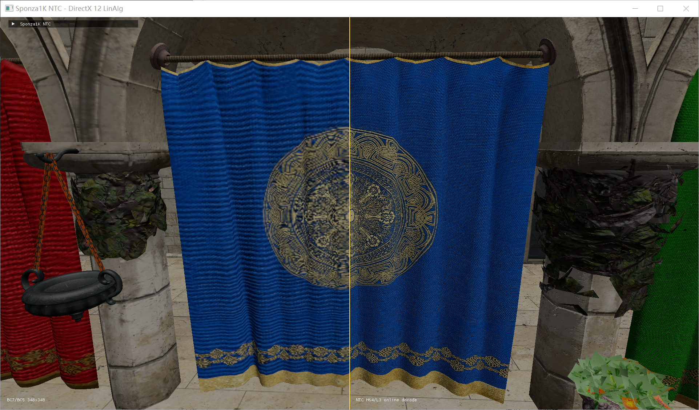

# Real-Time Neural Texture Compression on DirectX 12

A material-batched deferred renderer that decodes Neural Texture Compression (NTC) directly in the G-buffer pixel shader. The project uses DirectX 12 Shader Model 6.10 Linear Algebra through MiniDXNN, allowing the driver to lower FP16 matrix-vector operations to RDNA 4 wave-level matrix instructions on supported Radeon hardware.

The test scene contains 24 Sponza materials. Each material compresses eight 1024x1024 channels—diffuse RGB, normal XYZ, roughness, and metallic—into two quantized eight-channel feature grids plus a compact MLP. The payload is **0.348 bits per pixel per channel (BPPC)**, corresponding to **23.0x compression** relative to eight uncompressed 8-bit channels.

## Visual results

### Equal-storage BC7/BC5 vs. NTC

The BC baseline uses BC7 diffuse, BC5 normal, and BC5 roughness/metallic at 348x348. Its 363,312-byte payload per material is within 0.34% of the 364,544-byte NTC payload.



### Native 1K textures vs. NTC

Both halves use the same geometry, camera, G-buffer formats, and lighting. The right side performs online NTC reconstruction in the material pixel shader.


## Quality evaluation

Metrics are arithmetic means over 24 materials. PSNR and SSIM weight all eight material channels equally; LPIPS is evaluated on diffuse RGB with AlexNet (lower is better). The full machine-readable results are in [`docs/results/quality_metrics.json`](docs/results/quality_metrics.json).

| Codec | BPPC | 8-channel PSNR | 8-channel SSIM | Diffuse LPIPS | Compression |
| --- | ---: | ---: | ---: | ---: | ---: |
| **NTC** | **0.348** | **34.84 dB** | **0.9335** | **0.0044** | **23.0x** |
| Equal-storage BC7/BC5 | 0.347 | 27.32 dB | 0.7791 | 0.3930 | 23.1x |
| ASTC 12x12 | 0.339 | 30.69 dB | 0.8722 | 0.1241 | 23.6x |

ASTC storage uses the actual 1024x1024 payload: three textures, each padded to 86x86 blocks of 16 bytes. This is slightly above the asymptotic 0.333 BPPC because 1024 is not divisible by 12.

## Rendering and inference path

1. Import Sponza glTF geometry and group indices into one contiguous draw range per material.
2. Run a backface-culled depth prepass.
3. Bind each material's two latent grids, MLP weights, and material constants.
4. Submit depth-equal material draw calls into five G-buffer attachments.
5. Reconstruct a 64-value feature vector and evaluate the MLP inside the pixel shader.
6. Composite the G-buffer and render the profiling/camera UI.

The accelerated path calls `mininn::forward(...)` from [`shaders/dx12/sponza_ntc.frag`](shaders/dx12/sponza_ntc.frag). MiniDXNN wraps D3D12 Linear Algebra matrix loads and multiplies; on the tested Radeon RX 9070 XT, the AMD driver selects the RDNA 4 WMMA-capable hardware path. A numerically equivalent scalar shader-ALU scene is retained for direct A/B profiling.

The optimized full-quality path reduced maximum-window GPU time from 21.59 ms to 5.51 ms in the recorded RX 9070 XT experiment (**74% lower total GPU time**). The optimization combines hardware matrix operations with a depth prepass, latent-grid repacking, backface culling, and reduced per-fragment memory traffic. Runtime timestamp queries separately report the material G-buffer and total GPU duration.

## Core implementation

- [`src/dx12/main.cpp`](src/dx12/main.cpp): DirectX 12 frame loop, material draw submission, scene switching, GPU timestamps, camera controls, and ImGui diagnostics.
- [`src/dx12/NtcMaterialResources.cpp`](src/dx12/NtcMaterialResources.cpp): latent upload/repacking, FP16 network conversion, and MiniDXNN weight-layout preparation.
- [`shaders/dx12/sponza_ntc.frag`](shaders/dx12/sponza_ntc.frag): feature reconstruction and accelerated/scalar MLP variants in the G-buffer pixel shader.
- [`src/dx12/NativeMaterialResources.cpp`](src/dx12/NativeMaterialResources.cpp) and [`src/dx12/BcMaterialResources.cpp`](src/dx12/BcMaterialResources.cpp): native and equal-storage BC baselines.
- [`tools/eval_sponza1k_codec_quality.py`](tools/eval_sponza1k_codec_quality.py): PSNR/SSIM evaluation; [`tools/eval_sponza1k_lpips.py`](tools/eval_sponza1k_lpips.py): LPIPS evaluation.

## Build

Requirements:

- Windows 11 with Developer Mode enabled
- Visual Studio with C++20 support and CMake 3.24+
- A DirectX 12 driver exposing Linear Algebra `TIER_1_0`
- Hardware-accelerated FP16 matrix-vector multiply for the accelerated scenes
- MiniDXNN v0.4.0 and recursive dependencies

```powershell
git clone --branch codex/dx12-sponza1k-ntc-public --recurse-submodules https://github.com/daihaozhi/ntc1.git
cd ntc1
cmake --preset vs2026-x64
cmake --build --preset vs2026-release --target sponza1k_ntc_dx12
```

The Sponza source textures and trained checkpoints are not committed because of their size and upstream licenses. Place the glTF scene under `external/sponza1k` and exported NTC material directories under the paths expected by the selected scene in `src/dx12/main.cpp`.

## Run and profile

```powershell
# Hardware-accelerated H32, two-hidden-layer decoder
.\build-vs2026\Release\sponza1k_ntc_dx12.exe --scene ntc-h32-l2 --frames 300 --no-vsync

# Same network evaluated by general shader ALUs
.\build-vs2026\Release\sponza1k_ntc_dx12.exe --scene ntc-h32-l2-scalar --frames 300 --no-vsync

# Native and equal-storage visual comparisons
.\build-vs2026\Release\sponza1k_ntc_dx12.exe --scene native-ntc
.\build-vs2026\Release\sponza1k_ntc_dx12.exe --scene bc-ntc

# Stage-level maximum-window benchmark
.\build-vs2026\Release\sponza1k_ntc_dx12.exe --maximized --no-vsync --frames 300
```

The application reports Linear Algebra capability and hardware acceleration at startup. The in-window panel provides scene selection, FPS, CPU/GPU timings, editable camera position and yaw/pitch, and a camera lock for repeatable captures.

## Repository scope

This branch intentionally contains only the DirectX 12 NTC renderer, its shaders, evaluation scripts, and presentation assets. Training data, Sponza assets, generated checkpoints, binaries, captures, and shader caches are excluded.
